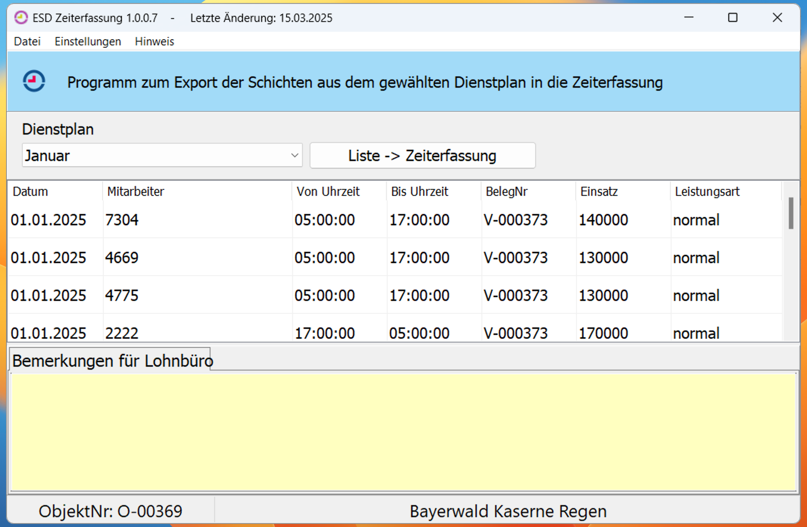
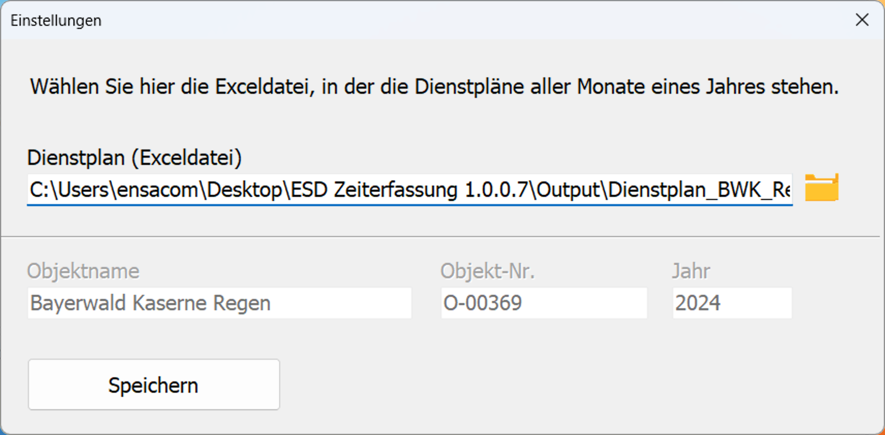
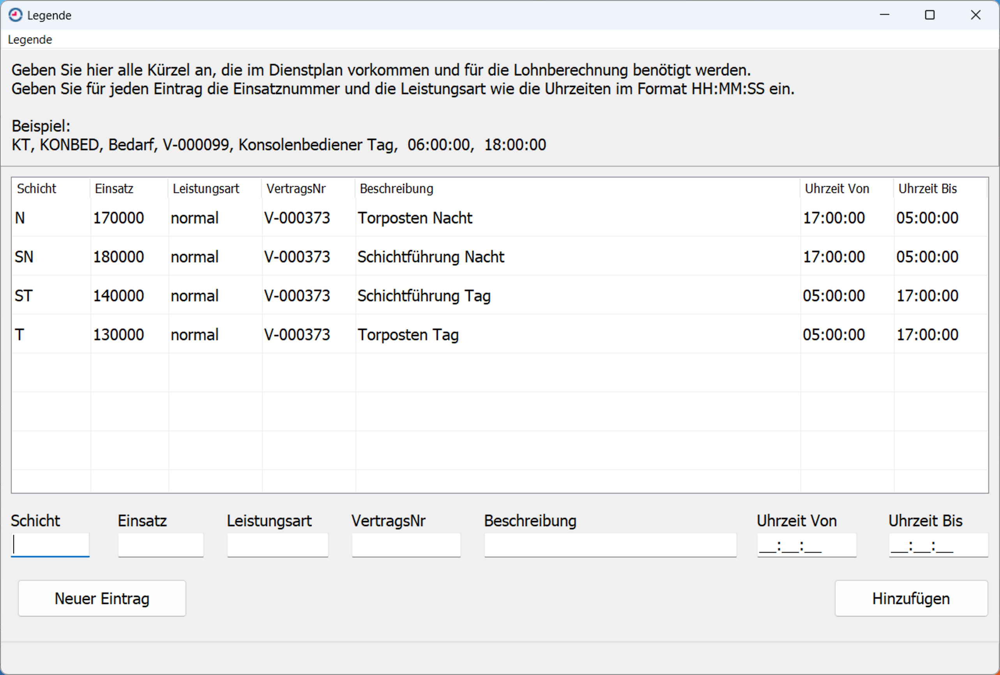

# ESD-Zeiterfassung 1.0.0.7

Dies ist ein Open Source Delphi-Projekt zur Zeiterfassung mit SQLite und OpenSSL.

## Merkmale

- Plattform: Windows
- Programmiert in: Delphi
- Datenbank: SQLite3
- Verschlüsselung: OpenSSL (libeay32.dll, ssleay32.dll)

## Lizenz

Veröffentlicht unter der MIT-Lizenz – siehe [LICENSE](./LICENSE).

## Screenshots

**Hauptfenster:**

**Einstellungen:**

**Legende:**

